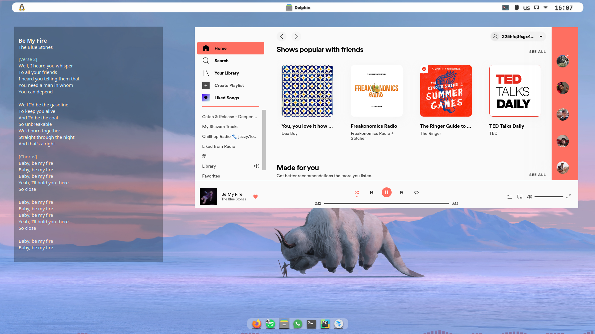

[![Stargazers][stars-shield]][stars-url]
[![Issues][issues-shield]][issues-url]
[![MIT License][license-shield]][license-url]

<br />
<p align="center">
  <a href="https://github.com/yarinbar/conklyr">
    
  </a>

  <h3 align="center">ConkLyr</h3>

  <p align="center">
    An awesome Conky widget that prints the lyrics of the currently played song
    <br />
  </p>
</p>


<!-- TABLE OF CONTENTS -->
<details open="open">
  <summary>Table of Contents</summary>
  <ol>
    <li>
      <a href="#about-the-project">About The Project</a>
    </li>
    <li>
      <a href="#getting-started">Getting Started</a>
      <ul>
        <li><a href="#installation">Installation</a></li>
      </ul>
    </li>
    <li><a href="#usage">Usage</a></li>
    <li><a href="#contributing">Contributing</a></li>
    <li><a href="#issues">Issues</a></li>

  </ol>
</details>


<!-- ABOUT THE PROJECT -->
## About The Project

Have you ever listen to a song and wondered "What are the lyrics???" but you were too lazy to 
search them?

If so, that is a conky widget for you.

This script connects to your Spotify account (you'll need to generate api credentials) and searches for the
lyrics using the Genius api (you'll need to register for that api as well - super fast & easy).

Once connected the lyrics will appear on the conky widget - scrolling along with the song and highlighting segment titles.


<!-- GETTING STARTED -->
## Getting Started
### Installation

Install [Conky](https://github.com/brndnmtthws/conky) in your machine.

Now you will need to create your own API credentials with both Spotify and Genius in the following links:

1. Spotify - Get a free API Key at [developer.spotify.com/dashboard/login](https://developer.spotify.com/dashboard/login)
2. Genius  - Get a free API Key at [docs.genius.com/](https://docs.genius.com/)

After completing the API registration, you'll need to run:

  ```sh
  git clone https://github.com/yarinbar/conklyr.git
  cd conklyr
  pip install -r requirements.txt
  ```

In this script we install the following:

```
numpy
matplotlib
spotipy==2.19.0
lyricsgenius==3.0.1
```

After installing `requirements.txt` you are basically done.


<!-- USAGE EXAMPLES -->
## Usage

assuming your shell is in the folder `conklyr`:

```shell
conky -c lyrics.conf
```

you can edit `lyrics.conf` arguments and also the arguments used by the 'lyrics.py' script to personalize the widget.


<!-- CONTRIBUTING -->
## Contributing

Contributions are what make the open source community such an amazing place to be learn, inspire, and create. Any contributions you make are **greatly appreciated**.

1. Fork the Project
2. Create your Feature Branch
3. Commit your Changes
4. Push to the Branch
5. Open a Pull Request


<!-- ISSUES -->
## Issues
These are the issues I have noticed so far:

1. changing the background (in the `.conf` file) color to anything other than `#000000` cant be transparent - I opened an issue on this one [here](https://github.com/brndnmtthws/conky/issues/1129)
2. right-to-left is not aligned
3. sometimes the last lines of the lyrics ends with a number
4. sometimes empty lines are removed for no apparent reason


<!-- LICENSE -->
## License

Distributed under the MIT License. See `LICENSE` for more information.


<!-- CONTACT -->
## Contact

Your Name - [@your_twitter](https://twitter.com/your_username) - email@example.com

Project Link: [https://github.com/your_username/repo_name](https://github.com/your_username/repo_name)


<!-- MARKDOWN LINKS & IMAGES -->
<!-- https://www.markdownguide.org/basic-syntax/#reference-style-links -->
[contributors-shield]: https://img.shields.io/github/contributors/othneildrew/Best-README-Template.svg?style=for-the-badge
[contributors-url]: https://github.com/othneildrew/Best-README-Template/graphs/contributors
[forks-shield]: https://img.shields.io/github/forks/othneildrew/Best-README-Template.svg?style=for-the-badge
[forks-url]: https://github.com/othneildrew/Best-README-Template/network/members
[stars-shield]: https://img.shields.io/github/stars/othneildrew/Best-README-Template.svg?style=for-the-badge
[stars-url]: https://github.com/yarinbar/conklyr/stargazers
[issues-shield]: https://img.shields.io/github/issues/othneildrew/Best-README-Template.svg?style=for-the-badge
[issues-url]: https://github.com/yarinbar/conklyr/issues
[license-shield]: https://img.shields.io/github/license/othneildrew/Best-README-Template.svg?style=for-the-badge
[license-url]: https://github.com/othneildrew/Best-README-Template/blob/master/LICENSE.txt
[linkedin-shield]: https://img.shields.io/badge/-LinkedIn-black.svg?style=for-the-badge&logo=linkedin&colorB=555
[linkedin-url]: https://linkedin.com/in/othneildrew
